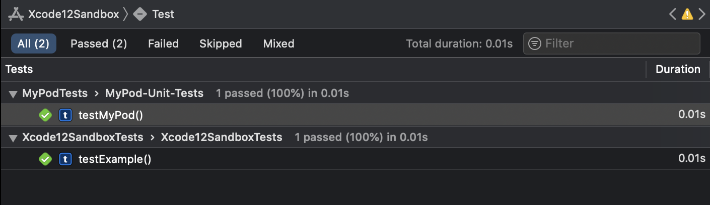
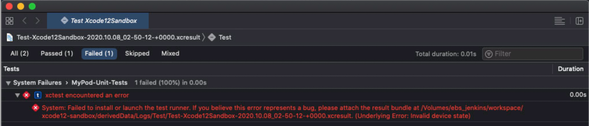

#  Xcode 12 Sandbox

Sandbox app to surface and investigate issues with CocoaPods test specs in combination with Jenkins and SSH sessions.

### Project Setup

This is a simple sample project illustrating a problem we face only on our CI systems. It consists of a sample app target (*Xcode12Sandbox*) and a development pod (*MyPod*). It utilizes [CocoaPods test specs](https://guides.cocoapods.org/using/test-specs.html) introduced in version 1.3 to run tests as part the sample app's app target.

```
Xcode12Sandbox
 - MyPod
   - MyPod/Tests test spec
```

### Issues

From the outset, there are a number of issues that required various workaround in trying to get Xcode 12 to work properly on CI:

1. After initial Xcode 12 install, `xcodebuild` could not find any available simulators. Only a full machine reboot was able to resolve that.
2. After reboot, while Simulators were now showing up (via `$ xcrun simctl list`) and working when connected via Screen Sharing, via SSH, *simctl* would report `iPhone 8 (4D50331C-EA89-4338-B723-4C97D49B743E) (Shutdown) (unavailable, failed to open liblaunch_sim.dylib)` (see https://developer.apple.com/forums/thread/662075) and only manually running `sudo xcrun simctl shutdown all && sudo xcrun simctl erase all` seemed to help.

But that seems to be the beginning...

When running the test suites via Xcode on my [local machine](#local-machine) both (*Xcode12SandboxTests* and *MyPod/Tests*) are succeeding. See screenshot below:



When running the test suites via Screen Sharing in Xcode on our [CI machine](#ci-machine) we have the same result. *However*, when running the same test suite via an SSH connection (either initiated by Jenkins or manually by connecting to the CI machine via SSH), the CocoaPod test spec _MyPod/Tests_ starts failing with the following errors:



```
$ set -o pipefail && env NSUnbufferedIO=YES xcodebuild -workspace Xcode12Sandbox.xcworkspace -scheme Xcode12Sandbox -configuration Debug -derivedDataPath derivedData -destination 'platform=iOS Simulator,id=8A409C64-E87B-4E31-99C3-7AA64226337E' -enableCodeCoverage YES test

[..]

Testing started
2020-10-08 02:50:14.637 xcodebuild[2693:76131]  IDETestOperationsObserverDebug: Writing diagnostic log for test session to:
/Volumes/ebs_jenkins/workspace/xcode12-sandbox/derivedData/Logs/Test/Test-Xcode12Sandbox-2020.10.08_02-50-12-+0000.xcresult/Staging/1_Test/Diagnostics/Xcode12SandboxTests-E7CF59F6-C680-4412-80C8-629860A4BDF7/Xcode12SandboxTests-7F072FC3-DC23-4313-BC05-DC4FB3DC4CBC/Session-Xcode12SandboxTests-2020-10-08_025014-IOadmM.log
2020-10-08 02:50:14.638 xcodebuild[2693:76062] [MT] IDETestOperationsObserverDebug: (3E5ECEF2-A830-4F8C-B783-F24495E16071) Beginning test session Xcode12SandboxTests-3E5ECEF2-A830-4F8C-B783-F24495E16071 at 2020-10-08 02:50:14.638 with Xcode 12A7300 on target <DVTiPhoneSimulator: 0x7ff406df3c90> {
		SimDevice: iPhone 11 (8A409C64-E87B-4E31-99C3-7AA64226337E, iOS 14.0, Shutdown)
} (14.0 (18A372))
2020-10-08 02:50:15.784 xcodebuild[2693:76062] [MT] IDETestOperationsObserverDebug: (3E5ECEF2-A830-4F8C-B783-F24495E16071) Finished requesting crash reports. Continuing with testing.
1
2020-10-08 02:50:19.198261+0000 Xcode12Sandbox[2943:83708] [SceneConfiguration] Info.plist configuration "(no name)" for UIWindowSceneSessionRoleApplication contained UISceneDelegateClassName key, but could not load class with name "Xcode12Sandbox.SceneDelegate".
2020-10-08 02:50:19.204584+0000 Xcode12Sandbox[2943:83708] [WindowScene] There is no scene delegate set. A scene delegate class must be specified to use a main storyboard file.
Test Suite 'All tests' started at 2020-10-08 02:50:19.244
Test Suite 'Xcode12SandboxTests.xctest' started at 2020-10-08 02:50:19.245
Test Suite 'Xcode12SandboxTests' started at 2020-10-08 02:50:19.245
Test Case '-[Xcode12SandboxTests.Xcode12SandboxTests testExample]' started.
Test Case '-[Xcode12SandboxTests.Xcode12SandboxTests testExample]' passed (0.002 seconds).
Test Suite 'Xcode12SandboxTests' passed at 2020-10-08 02:50:19.247.
	 Executed 1 test, with 0 failures (0 unexpected) in 0.002 (0.002) seconds
Test Suite 'Xcode12SandboxTests.xctest' passed at 2020-10-08 02:50:19.248.
	 Executed 1 test, with 0 failures (0 unexpected) in 0.002 (0.003) seconds
Test Suite 'All tests' passed at 2020-10-08 02:50:19.248.
	 Executed 1 test, with 0 failures (0 unexpected) in 0.002 (0.004) seconds
2020-10-08 02:50:19.523 xcodebuild[2693:76130]  IDETestOperationsObserverDebug: Writing diagnostic log for test session to:
/Volumes/ebs_jenkins/workspace/xcode12-sandbox/derivedData/Logs/Test/Test-Xcode12Sandbox-2020.10.08_02-50-12-+0000.xcresult/Staging/1_Test/Diagnostics/MyPod-Unit-Tests-A654EF9C-E815-4ED3-A2B0-8F59D3DF8CD9/MyPod-Unit-Tests-7C19E6B0-3E14-4C76-87FE-C469CBB87836/Session-MyPod-Unit-Tests-2020-10-08_025019-ECecfr.log
2020-10-08 02:50:19.523 xcodebuild[2693:76062] [MT] IDETestOperationsObserverDebug: (2EB60E45-36C9-4691-81CB-CCEE8AEB6C33) Beginning test session MyPod-Unit-Tests-2EB60E45-36C9-4691-81CB-CCEE8AEB6C33 at 2020-10-08 02:50:19.523 with Xcode 12A7300 on target <DVTiPhoneSimulator: 0x7ff406df3c90> {
		SimDevice: iPhone 11 (8A409C64-E87B-4E31-99C3-7AA64226337E, iOS 14.0, Booted)
} (14.0 (18A372))
2020-10-08 02:50:19.524 xcodebuild[2693:76062] [MT] IDETestOperationsObserverDebug: (2EB60E45-36C9-4691-81CB-CCEE8AEB6C33) Finished requesting crash reports. Continuing with testing.


*** If you believe this error represents a bug, please attach the result bundle at /Volumes/ebs_jenkins/workspace/xcode12-sandbox/derivedData/Logs/Test/Test-Xcode12Sandbox-2020.10.08_02-50-12-+0000.xcresult

2020-10-08 02:50:22.341 xcodebuild[2693:76062] [MT] IDETestOperationsObserverDebug: 7.708 elapsed -- Testing started completed.
2020-10-08 02:50:22.341 xcodebuild[2693:76062] [MT] IDETestOperationsObserverDebug: 0.000 sec, +0.000 sec -- start
2020-10-08 02:50:22.341 xcodebuild[2693:76062] [MT] IDETestOperationsObserverDebug: 7.708 sec, +7.708 sec -- end

Test session results, code coverage, and logs:
	/Volumes/ebs_jenkins/workspace/xcode12-sandbox/derivedData/Logs/Test/Test-Xcode12Sandbox-2020.10.08_02-50-12-+0000.xcresult

Testing failed:
	MyPod-Unit-Tests:
		xctest encountered an error (Failed to install or launch the test runner. If you believe this error represents a bug, please attach the result bundle at /Volumes/ebs_jenkins/workspace/xcode12-sandbox/derivedData/Logs/Test/Test-Xcode12Sandbox-2020.10.08_02-50-12-+0000.xcresult. (Underlying Error: Invalid device state))
```

Please find _xcresult_ zipped up in this repository. I tried various tips from the interwebs.. from erasing and resetting the simulators before the test runs to force quitting and pre-launching the simulators. None seemed to help. I have yet to find a way to quit and relaunch simulators between test suites though.

### Workstation Configuration

#### Local machine

MacBook Pro (16-inch, 2019)\
macOS Catalina 10.15.7\
Xcode 12.0 (12A7209)

#### CI machine

Mac mini (2018)\
macOS Catalina 10.15.6\
Xcode 12.0.1 (12A7300)